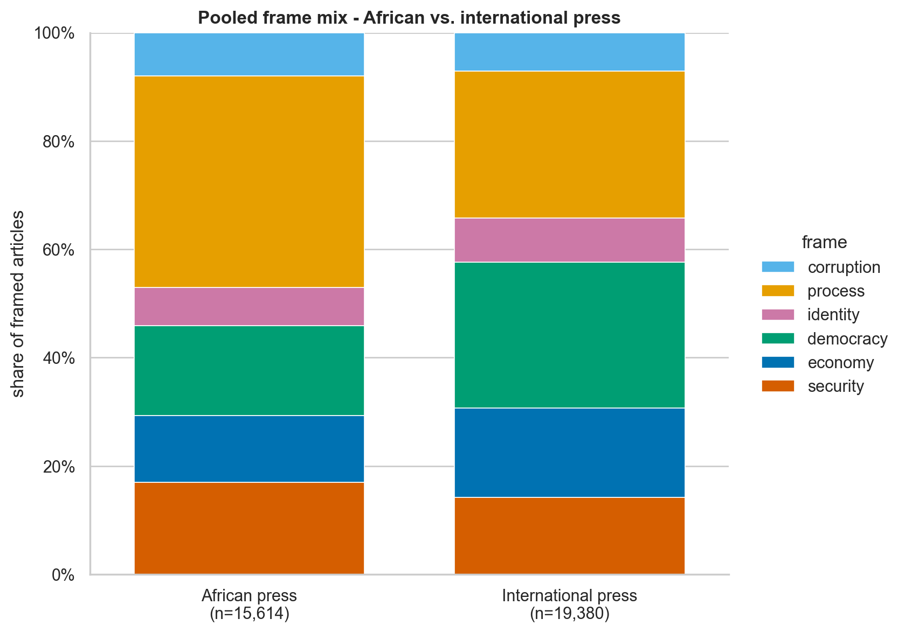
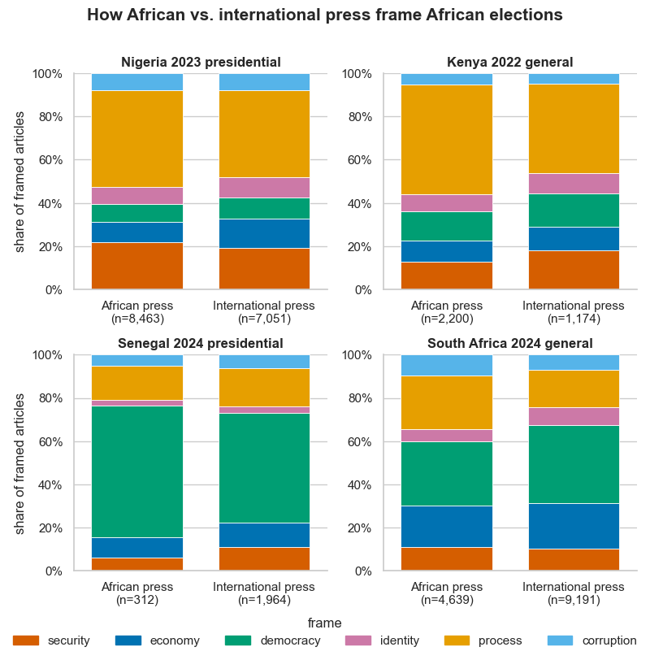
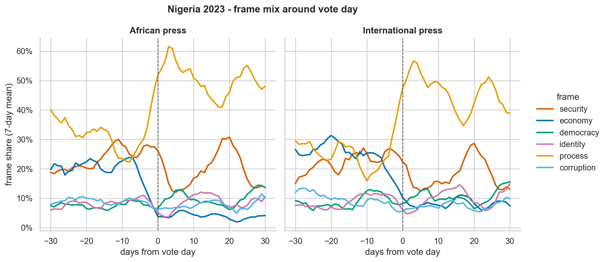
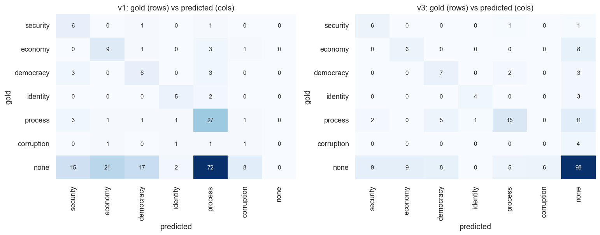
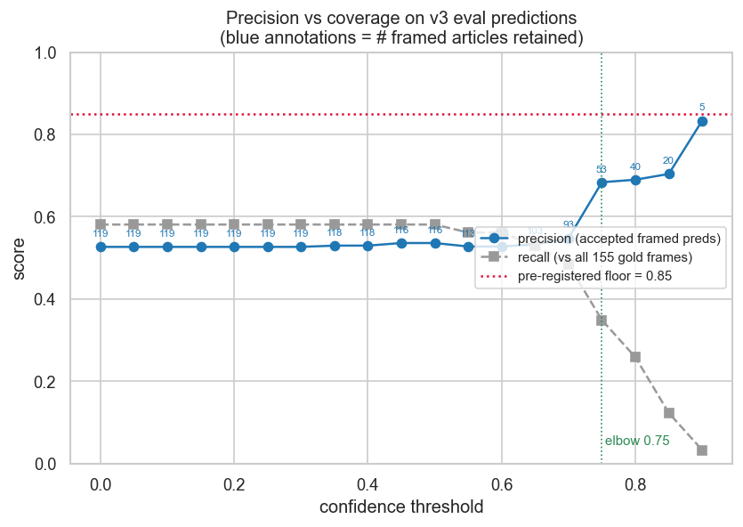
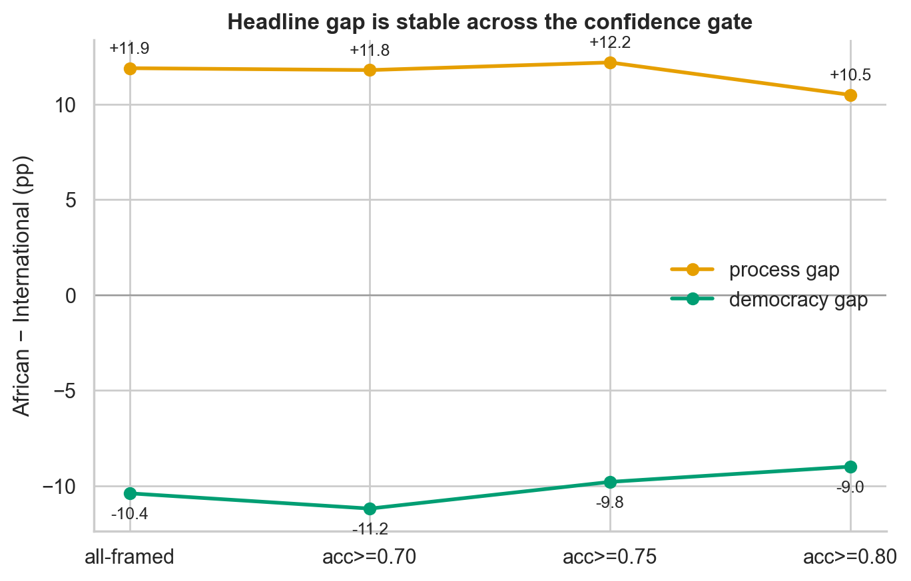
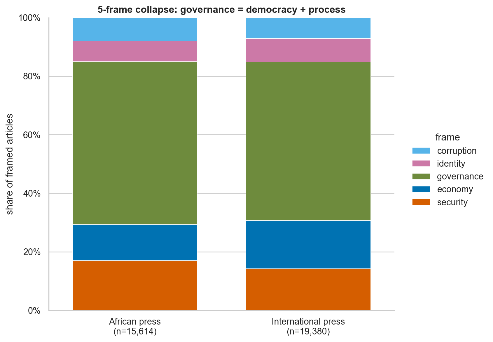

# Do international and African outlets cover the same election as if they were two different events?

**A framing analysis of four recent African elections — Nigeria 2023, Kenya 2022, Senegal 2024, South Africa 2024**

*Author: Muhanad Abulhusn · Social Data Analyst*
*Method: GDELT 2.0 corpus · LLM frame classification · hand-labeled evaluation · sensitivity-tested*

---

## Executive summary

Take a single election — say, Nigeria's 2023 presidential vote — and read the morning's coverage from a Lagos newsroom alongside the wire copy filed from a London or New York desk. Both report the same event. They do not report the same *story*. The Nigerian outlet walks you through the mechanics: who registered, where the results stalled, which court challenge is moving. The international wire reaches for the larger stakes: is this a democracy consolidating or backsliding? That intuition is old and has lived mostly in essays. This project measures it.

I pulled every English-language article GDELT indexed in a ±30-day window around each of four recent African elections, classified the dominant *frame* of each one against a six-dimension taxonomy using a large language model, and validated those machine labels against a gold set I hand-labeled myself. The result, pooled across all four elections and computed over the articles where a frame was clearly present: **African outlets foreground the *process* of voting at 39.0% of framed articles versus 27.1% for international outlets (a +11.9 percentage-point gap), while international outlets foreground *democratic stakes* at 26.9% versus 16.5% (a −10.4 pp gap).** Those two are the largest divergences by a wide margin; every other frame differs by three points or less.

The finding is descriptive, not a verdict on who covers elections better. And the headline number is genuinely *not* the point of the work. What I want a reader to take from this is the discipline wrapped around that number: a 79,372-article pipeline whose every consequential choice was made diagnostic-first and documented, an LLM classifier scored against human labels before its output was ever trusted, and three sensitivity checks that say plainly which decisions the conclusion depends on and which it does not. One of those checks shows the headline is load-bearing on a single taxonomic distinction. I report that openly rather than burying it, because knowing where a result is fragile is the analysis.

---

## 1. The question, and what it is not

Four recent African elections were covered simultaneously by African and international press: Nigeria 2023, Kenya 2022, Senegal 2024, and South Africa 2024. I asked whether the *frames* applied to those elections differ systematically by where the outlet is published, and along which of six dimensions: security, economy, democracy, identity, process, or corruption.

Two boundaries matter from the outset. This is not sentiment analysis. I am not asking whether coverage is positive or negative; I am asking which dimension of the story gets foregrounded, which is a different and more tractable question. And this is not an evaluation of coverage quality or accuracy. "International outlets foreground democracy at 27%" is a statement about emphasis, not about whether that emphasis is correct or fair. Framing analysis is descriptive by construction, and I hold to that throughout.

The unit of measurement is the *primary frame* — the single dimension the classifier judged most foregrounded in an article — and all headline percentages are computed over **framed articles only**, meaning the ones where a frame was clearly present at all. That qualifier turns out to carry real weight, and I return to it in §4.

---

## 2. Data and pipeline

The corpus comes from the [GDELT 2.0 Global Knowledge Graph](http://data.gdeltproject.org/gdeltv2/), an article-level index of global news metadata. I pulled the GKG records for the ±30-day window around each of the four elections, which after cleaning yielded **79,372 articles**. Outlet provenance — the African-versus-International label that the entire analysis pivots on — is a hand-curated list, and the evaluation set against which I scored the classifier was hand-labeled by me, blind, never generated by the model it would judge.

The pipeline runs in four stages. Ingestion pulls the raw GKG records. Cleaning filters to election-relevant English-language articles, removes duplicates, and attributes each one to an origin bucket. Classification assigns frames via a large language model. Evaluation scores those machine labels against the gold set, and only after the evaluation cleared a documented quality bar did I treat the production labels as analytically usable. The funnel from raw firehose to analytic corpus is steep, and deliberately so:

| Election | Raw GKG rows | Relevant | English | After dedup |
|---|---:|---:|---:|---:|
| Nigeria 2023 presidential | 6,621,830 | 40,776 | 40,223 | 29,724 |
| Kenya 2022 general | 6,587,750 | 10,147 | 9,955 | 6,119 |
| Senegal 2024 presidential | 8,875,777 | 4,400 | 4,320 | 3,820 |
| South Africa 2024 general | 8,604,730 | 44,043 | 43,740 | 39,709 |
| **Total** | **30,690,087** | **99,366** | **98,238** | **79,372** |

Thirty million raw rows collapse to under a hundred thousand relevant ones. That ratio is the whole problem of working with GDELT: the firehose is global and mostly noise relative to any specific question, so the relevance filter is doing the heavy lifting of aligning a generic corpus with a specific research question.

---

## 3. The headline finding

Here is the core comparison, pooled across all four elections and rendered as the share of each origin's framed articles going to each of the six frames.

Read the two bars against each other and the story is in two bands. The orange *process* band is markedly taller on the African side. The green *democracy* band is markedly taller on the international side. Everything else — security, economy, identity, corruption — is close enough that I would not lean on it.

The numbers behind the picture:

| Frame | African (% framed) | International (% framed) | Gap (African − Intl) |
|---|---:|---:|---:|
| process | 39.0 | 27.1 | **+11.9** |
| security | 17.0 | 14.2 | +2.8 |
| corruption | 8.0 | 7.1 | +0.9 |
| identity | 7.1 | 8.1 | −1.0 |
| economy | 12.4 | 16.5 | −4.2 |
| democracy | 16.5 | 26.9 | **−10.4** |

*Framed n: 15,614 African, 19,380 International.*

African coverage gives *process* — registration, logistics, counting, results, court challenges, the machinery of the vote itself — 39.0% of its framed articles, against 27.1% for international coverage. International coverage gives *democracy* — institutional health, backsliding or consolidation, civil liberties — 26.9%, against 16.5% for African coverage. The two largest gaps point in opposite directions, and they are the structural signature of the dataset: African outlets attend to *how the vote runs*; international outlets attend to *what the vote means for the system*.

### The split holds across elections — with one instructive exception

Pooling can hide as much as it reveals, so I broke the comparison out by election.

The process-over-democracy tilt in African coverage holds in three of the four contests: Nigeria (+4.5 pp process), Kenya (+9.5 pp), and South Africa (+7.5 pp), with democracy correspondingly higher in international coverage in all three. Senegal 2024 inverts the pattern, and the inversion is the most interesting data point in the panel. Both origins there are dominated by *democracy* (African coverage 61%, international 51%), because the defining event was not an ordinary vote but a constitutional crisis: President Sall's attempt to postpone the election made the *health of the institution itself* the story, for everyone. When the democratic stakes become the literal news event, the origin gap dissolves. That is exactly what you would predict if the frames are tracking something real about each election rather than an artifact of who is writing.

Senegal also carries the thinnest African sample in the study — 312 framed articles — so I read its panel with more caution than the others, for reasons §6 makes explicit.

### Coverage pivots from issues to mechanics around vote day

The frame mix is not static across the 60-day window; it rotates as the vote approaches and passes.

Pooled across all four elections, the *process* share climbs from 23.4% in the pre-period (−30 to −8 days) to 33.9% during vote week to 36.7% in the post-period (+8 to +30 days), while *economy* falls in near-mirror image from 20.7% to 10.9%. Before the vote, outlets argue about the issues — the economy, the state of democracy. During and after, they cover the event itself: the count, the result, the disputes. The Nigeria timeline above shows the same pivot in both origin facets, with the orange process surge sharper and earlier on the African side. The rotation is a useful sanity check on the classifier, too: a frame labeler that produced this clean a temporal structure is responding to genuine signal, not noise.

### "African framing" is not one thing

The headline treats African press as a single block. It is not, and saying so is part of being honest about the result. Splitting the African rows by the source domain's country tells a more textured story:

| Country (African block) | security | economy | democracy | identity | process | corruption | n |
|---|---:|---:|---:|---:|---:|---:|---:|
| Kenya | 11.6 | 9.3 | 15.3 | 8.0 | **50.1** | 5.7 | 1,623 |
| Nigeria | 19.9 | 9.0 | 10.0 | 8.4 | **45.7** | 7.0 | 3,807 |
| South Africa | 11.7 | 18.9 | **27.4** | 6.0 | 26.9 | 9.1 | 3,605 |

Nigerian and Kenyan outlets are heavily process-dominated; South African outlets are democracy-and-economy-balanced, looking far more like the international profile than like their continental peers. So the African-to-process tilt in the pooled headline is really a *Nigerian-and-Kenyan* tilt that South African coverage partly offsets. The continental contrast is real, but it is a weighted average of quite different national presses, and a reader should hold "African framing" loosely as a label.

---

## 4. Why the classifier abstains, and why that is itself a finding

More than half the articles in this corpus carry *no* clear frame. That sounds like a defect; it is a finding.

The input to the classifier is GDELT metadata only — a title slug, a list of named entities, a set of theme tags. No article bodies were scraped. A great deal of that metadata is simply too thin to foreground any dimension: a one-line wire stub announcing a result names no stakes and foregrounds no theme. When I hand-labeled the 250-article evaluation set, blind, I judged **135 of 250 (54%)** of those snippets to carry no clear frame at all. A classifier that cannot say "no clear frame" would therefore be wrong on the majority class by construction — which is why abstention is a first-class behavior in this system, instructed in the prompt and scored explicitly, not an error mode.

The production data reproduces the pattern, and the abstention *rate itself* divides by origin:

| | African | International |
|---|---:|---:|
| **Abstention rate** | 44.6% | 62.0% |

International coverage is far more often too thin to frame — **61.9%** of international rows abstain against 44.6% of African rows. International coverage of these elections skews to short wire briefs and aggregator stubs, a sentence of metadata apiece, whereas African outlets more often carry metadata substantive enough to foreground a dimension. This is a framing-divergence result in its own right. It is also a methodological caution that I want stated plainly rather than hidden: the headline mix in §3 is computed over the roughly 45% of African rows and 38% of international rows that clear the abstention bar. The abstaining majority carries no frame by construction, and the headline says nothing about it.

---

## 5. The classifier, and how I know it works

The flagship deliverable here is not the headline percentage. It is the pipeline-plus-evaluation discipline that earns the right to report it. A frame classifier is only as trustworthy as the evidence that it classifies frames the way a careful human would, so I built the evaluation before I trusted a single production label.

### The taxonomy is a choice, and I treated it as one

Six frames — security, economy, democracy, identity, process, corruption — is one defensible cut of political coverage, not a law of nature. I decided the granularity *after* labeling and evaluation, using observed boundary behavior rather than a priori intuition. The dominant confusion in the evaluation set, by a wide margin, is the seam between *democracy* and *process*: a supreme-court challenge to a result is simultaneously "this vote's integrity" (process) and "the health of the institution" (democracy), and a reasonable human can label it either way. My own labeler notes say as much on several rows.

I could have made that confusion disappear by merging the two frames into a single "governance" frame, and doing so lifts the classifier's evaluation micro-F1 from 0.552 to 0.598. I chose not to, for the headline, because merging deletes the exact distinction the research question is about. The whole point is to ask whether coverage emphasizes *the mechanics of this vote* versus *the health of democratic institutions*; collapsing them would optimize a metric at the cost of the finding. I kept the six-frame split on substantive grounds and then stress-tested that decision openly in §6, where it turns out to matter more than any other.

### Prompt iteration: one change at a time, every version scored

I ran the classifier prompt through four versions, changing one thing at a time so that each score delta is attributable to a specific edit. The narrative of *why* each revision happened is part of the deliverable.

| Version | The one change | micro-F1 | What it fixed or broke |
|---|---|---:|---|
| v1 | initial draft; cannot abstain | 0.441 | Predicts a frame for all 250 rows; the 135 no-frame rows scatter into false positives. Abstain-F1 = 0.00. |
| v2 | enable and instruct abstention | 0.523 | Abstain-F1 jumps to 0.77; per-frame precision roughly doubles. New, narrower fault: over-abstains on genuinely framed rows. |
| **v3** | few-shot examples rewritten in the metadata format the model actually sees | **0.552** | Recovers process/security/democracy recall. Best micro-F1 of the series. **Selected.** |
| v4 | explicit democracy↔process disambiguation rule | 0.522 | Cuts democracy false positives but pushes *real* democracy rows into process. Micro-F1 regresses. |

The progression from v1 to v3 is monotone improvement on the headline metric. I kept v4 on purpose even though it regressed, because it is the probe that proves a point: a sharp verbal rule on the democracy-process boundary does not fix the seam, it just trades one direction's errors for the other's. The seam is taxonomy-inherent, not a prompt defect — which is precisely what justified the substantive decision to keep the two frames separate.

The confusion matrices make the v1-to-v3 improvement visible at a glance.

In v1 (left), the entire `none` row empties into the frame columns — 72 genuinely frameless rows misread as *process* alone — because the model has no way to abstain and so manufactures signal. In v3 (right), the `none`-to-`none` cell is dominant; the model abstains correctly on most thin snippets, and the residual error concentrates on the democracy-process diagonal that the taxonomy decision already addressed.

I stopped at v3 rather than chasing a v5, and the stopping condition was pre-registered: tuning stops when the dominant residual error becomes *debatable human labels* rather than model mistakes. Past that point, more prompts would fit noise. The roughly 0.55 micro-F1 ceiling is set by the metadata-only input — half the rows are genuinely unframeable — not by the prompt, so it would not yield to further prompt engineering. The modest headline metric is modest *on purpose*, and I would rather say that than dress it up.

### The cheaper model won

I A/B-tested two models on identical prompts: `deepseek-v4-flash` (cheap, the default) against `minimax-m2.7` (larger, nominally stronger). The smaller model won on every axis that mattered. On accuracy it beat the larger model (micro-F1 0.552 versus 0.460 at v3). It ran two to three times faster (median ~6 seconds per call versus ~15) and was far more reliable (roughly 4–5 transient API errors per 250-row pass versus ~28). The "more powerful" model over-interpreted thin metadata, assigning more frames than were there and inflating false positives. For a constrained classification task on deliberately thin inputs, raw model capability is not the bottleneck — abstention behavior and precision are, and the small model handled those at a fraction of the cost and latency. The larger model stays wired in only as a hard-failure fallback.

### Cost discipline

The full production classification of all 79,372 articles cost **$22.89** and ran in nine to eighteen hours, resumable, with the per-run cost logged to a committed file so the figure can be read without re-running the pass. The total project LLM spend, including all evaluation runs, was **$23.32**. I mention the number because cost-awareness is part of building a system someone else has to run, not an afterthought to it.

### The confidence threshold: a flag, not a filter

The single most consequential methodological decision in the whole project is one I want to walk through, because it is where the temptation to do the convenient thing was strongest.

I pre-registered a precision floor of ≥0.85 for accepting a label, before any evaluation data existed. When the data arrived, that floor turned out to be unreachable at any usable coverage. The metadata-only input caps achievable precision in the high-0.60s, and a 0.85 threshold survives on just 5 of 250 evaluation rows.

The precision-versus-coverage curve has exactly one clean elbow, at confidence 0.75, where precision jumps from 0.547 to 0.684 as coverage falls from 93 to 53 framed articles. So 0.75 is the defensible operating point. But here is the trap: gating the data at 0.75 is **not frame-neutral**. It shifts the primary-frame mix by +15 pp toward democracy and −10 pp away from process. Because the headline finding *is* a frame distribution, applying that gate to the headline would distort the very dependent variable I am measuring.

I therefore stored the threshold as a *flag*, not a *filter*. Every production row is written with its label, its confidence, and an `accepted` boolean (`accepted = framed AND confidence ≥ 0.75`); no row is dropped. The headline analysis uses all framed labels, with the accepted-only view carried as a robustness lens. The pre-registered floor was relaxed and the relaxation documented in full, rather than honored as a technicality that would have shrunk the corpus to 3% coverage and biased the result. Choosing the right answer over the convenient floor, and writing down exactly why, is the decision I am most willing to defend.

---

## 6. Robustness — which decisions the conclusion depends on

A finding you have not tried to break is a finding you do not understand. I stress-tested the three decisions most likely to swing the headline — the confidence threshold, the deduplication threshold, and the taxonomy granularity — by re-deriving the headline under each perturbation and measuring how far it moved. Two of the three are robust. One is load-bearing, and I say so.

### Confidence threshold: robust

Re-running the headline at accepted-only gates of 0.70, 0.75, and 0.80 holds the gap firmly in place.

The process gap stays in the band [+10.5, +12.2] pp and the democracy gap in [−11.2, −9.0] pp across the all-framed headline and every accepted-only threshold. Direction and rank order never change. What *does* move is the absolute level — African process falls from 39.0% to 29.5% as the gate tightens to 0.80, exactly the non-neutrality the threshold decision flagged. But that shift lands on both origins together and cancels in the difference. The gate is not frame-neutral, yet it is approximately origin-neutral *in the difference*, and the difference is what the headline reports.

### Deduplication threshold: robust

Wire copy gets syndicated across dozens of outlets, so I deduplicated near-identical articles using MinHash at a Jaccard threshold of 0.8. Re-running at 0.7 and 0.9 changes the kept-row count by no more than 2% on the diagnostic probe. More to the point, the rows whose survival flips between the loose and tight thresholds — the swing set — split ~73% International / 27% African, almost exactly tracking the corpus mix of ~74/26. Because the threshold adds and removes rows in proportion to each origin, it cannot move a between-origin gap regardless of how many rows it touches. A proportional 2% change in sample size cannot shift an 11-point gap.

### Taxonomy granularity: load-bearing

Here is where the conclusion is fragile, and where I think honesty earns its keep. If *democracy* and *process* are merged into a single *governance* frame, the headline gap collapses from +11.9/−10.4 pp to **+1.5 pp**.

Look at the merged bars and the two presses are nearly identical: African and international coverage give *governance* almost the same total attention (55.6% versus 54.1%). They diverge entirely in *how they split it* — African press toward the mechanics, international press toward the democratic stakes. So the right way to read the headline is conditional: *treating "process" and "democracy" as distinct dimensions, African and international coverage split their governance attention in opposite directions.* That conclusion is insensitive to the confidence gate and the dedup threshold, but it is inseparable from the taxonomic decision to keep those two frames apart.

I defend that decision on substantive grounds — the procedural-versus-institutional distinction *is* the research question, and merging it away to gain 0.05 of micro-F1 would answer a different, less interesting question. But a reader is entitled to know that the headline rests on it, and now they do.

---

## 7. Limitations

Every result above is bounded, and I would rather enumerate the bounds than let a reader discover them.

The corpus is whatever GDELT crawls — English-language, publicly indexed sources — so it is a sample of coverage, not a census. The English-only filter is a real cost in one specific place: it largely excludes the francophone Senegalese press, leaving Senegal's African sample at just 312 framed rows, roughly 18 of them from `.sn` domains, with local Wolof and French framing reachable only through international wires. I read the Senegal panel with explicit caution for that reason. The classifier sees GDELT metadata only, never article bodies, which is what caps its precision and drives the 54% abstention rate; the labels are an evaluated approximation, not ground truth, and the evaluation micro-F1 of 0.552 says exactly how good an approximation. The framed-only headline is computed on the minority of rows that clear the abstention bar. The six-frame taxonomy is one defensible cut, stress-tested rather than assumed away, and shown above to be the decision the headline most depends on. "African" is a continental block at the headline level whose internal variation is real and surfaced separately. And the entire analysis is descriptive: it says which frame is foregrounded, never *why*, and never whether the coverage is good.

None of these sink the finding. They locate it. The process-versus-democracy divergence is robust to the two perturbations that could have been confounds and survives every confidence gate; what it asks of the reader is that they accept the taxonomy that makes it visible and treat the magnitudes as the evaluated approximations they are.

---

## 8. What this demonstrates

Strip away the subject matter and this project is a worked answer to a recurring question in applied data work: how do you trust a label you did not generate by hand? The answer here was to build the trust infrastructure first — a blind gold set, a per-version prompt evaluation with a pre-registered stopping condition, a model A/B that chose the cheap option on evidence, a confidence policy that refused to bias the dependent variable, and a robustness pass that names the one decision the conclusion hangs on. The headline finding is real and, within its documented bounds, robust. The reason to believe it is everything around it.

The natural next step is to lift the metadata-only ceiling. Scraping article bodies would almost certainly cut the 54% abstention rate and raise the precision ceiling out of the high-0.60s, which would in turn let the confidence gate become a filter rather than a flag and open the door to splitting *process* into its logistics-versus-results sub-frames — the seven-frame question this study deliberately left for a corpus that can support it. The framework is built to take that input. The question it answers would only get sharper.

---

*Full analysis, decision logs, and reproducible notebooks: [github.com/Muhanad-husn/African-elections-frame-analysis](https://github.com/Muhanad-husn/African-elections-frame-analysis)*
